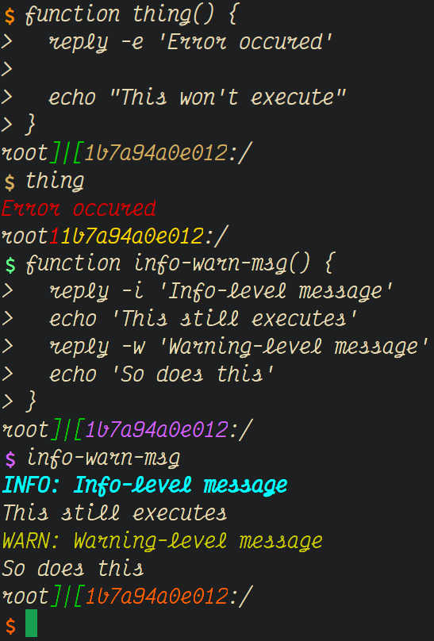

# 01reply.sh  
_Color-code message-levels_  

---  

# Usage  
```
reply [-c|e|i|w] [message]

-c  Clear the line before printing(INFO)
-e  Print red message and quit the function here
-i  Print cyan message and continue script
-w  Print green message and continue script
```  
### Aliases  
```
clr clear the row and write info message
err write a red error message and quit
nfo write a cyan info message and continue
wrn write a yellow warning message and continue
```  
---  
__Examples:__  
  
  
